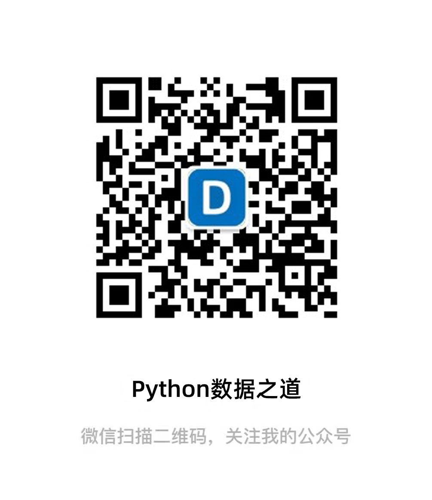

Python 在财经领域的一些实践。
## 微信公众号

欢迎关注个人微信公众号“**Python数据之道**”（公号ID：**PyDataLab** ）。

    

微信公众号上目前已发布的部分文章链接，以及对应的代码或数据文件如下：

|文章发布日期|文章名称及链接|代码 / 数据文件|
|-------|---------|---------|
|20210131|[财经数据神器 Tushare，股票数据全搞定](https://mp.weixin.qq.com/s/c1ukemeK12flCgA-lo69fA)|[请点击链接](https://github.com/liyangbit/PyDataRoad/tree/master/comprehensive/Tushare)|
